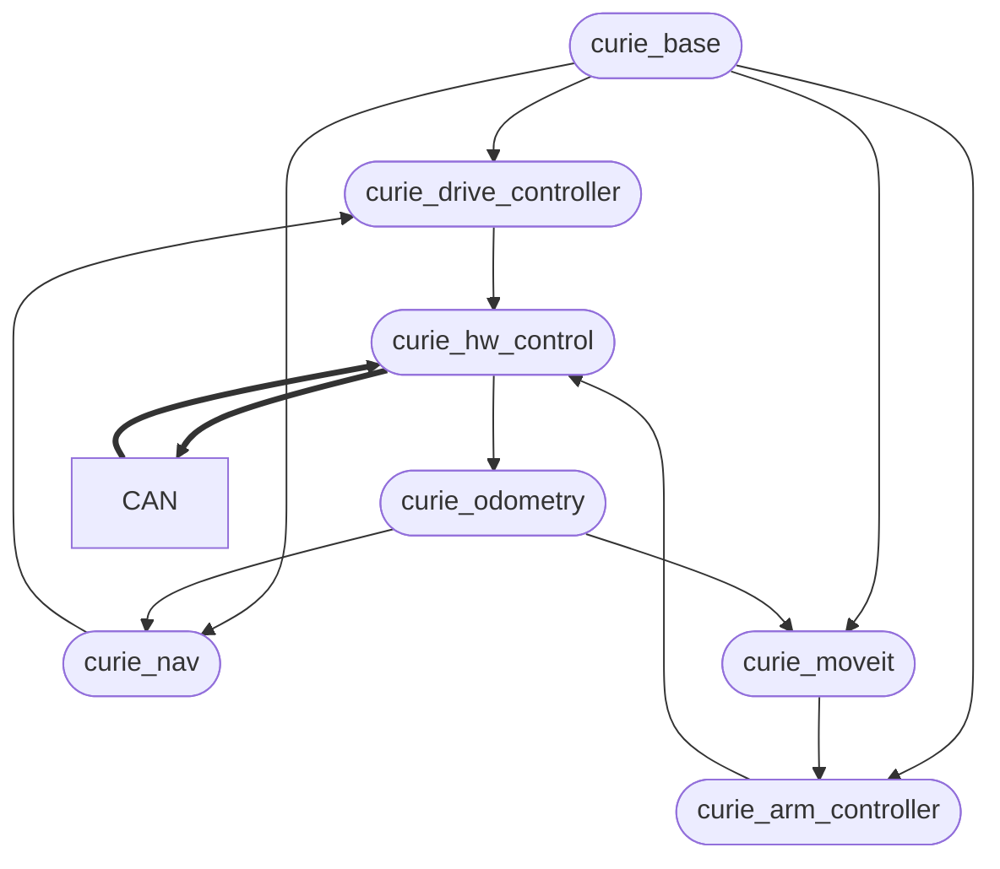

# Curie ROS2 Architecture

```mermaid
graph TB
    dc([curie_drive_controller])
    ac([curie_arm_controller])
    odom([curie_odometry])
    hw([curie_hw_control])
    base([curie_base])
    nav([curie_nav])
    moveit([curie_moveit])

    base --> dc
    base --> ac
    base --> nav
    base --> moveit
    dc --> hw
    ac --> hw
    hw --> odom
    odom --> nav
    odom --> moveit
    nav --> dc
    moveit --> ac
    hw ==> CAN
    CAN ==> hw
```